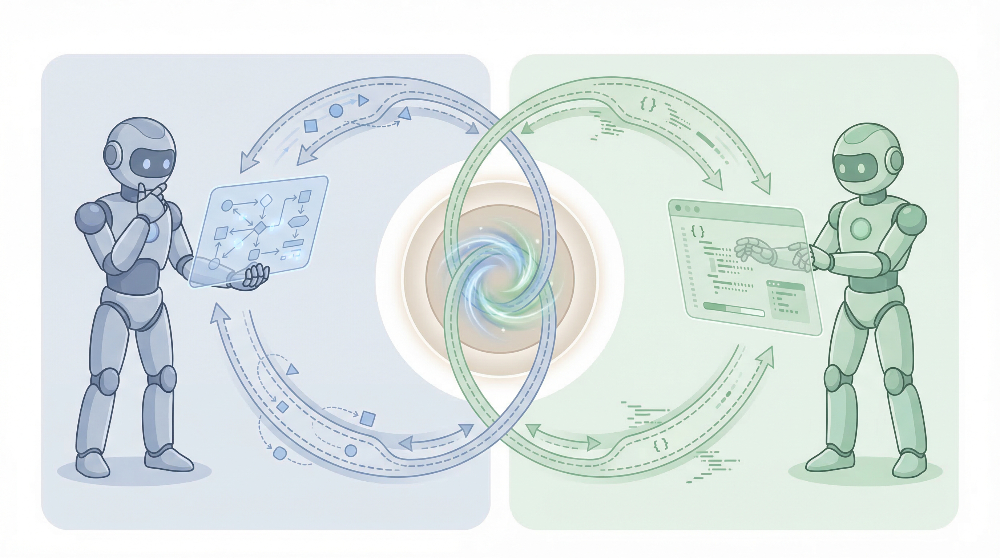

<p align="center">
  
</p>

<h1 align="center">crossfire</h1>
<p align="center">
  <strong>Actor-Critic collaboration for Claude + Codex</strong><br/>
  Two AI partners walk into your repo. One draws the map, one carries the toolbox, both argue like a championship debate team.
</p>
<p align="center">
  
  
  
  
</p>

## What is this?
What happens when you lock Claude and Codex in a room and tell them to agree on your architecture? Surprisingly good code.

`crossfire` is a Claude Code skill that runs an end-to-end Actor-Critic pipeline:
- Claude Code (Opus 4.6) plays Architect/Reviewer: the detective with the whiteboard and conspiracy strings.
- Codex CLI (GPT-5.3-Codex) plays Executor/Auditor: the heavy lifter who codes fast and double-checks everything like a suspicious airport inspector.

Phase 0 is basically couples therapy for AIs. Phase 2 is trust issues as a service. Your codebase is the winner.

Inspired by [heterogeneous multi-agent debate](https://arxiv.org/abs/2602.03794) — diverse models catch each other's blind spots better than homogeneous teams.

## Pipeline Overview
The workflow is strict enough for production, with just enough comedy to keep standup meetings survivable.

```text
Task
  |
  v
+-------------------------------------------------------------+
| Phase 0 (Architect Loop)                                    |
| Claude: EXPLORE -> PLAN -> DEBATE(with Codex) -> LOCK       |
+-------------------------------------------------------------+
  |
  v
+-------------------------------------------------------------+
| Phase 1 (Execution)                                         |
| Codex: IMPLEMENT exactly from locked blueprint              |
+-------------------------------------------------------------+
  |
  v
+-------------------------------------------------------------+
| Phase 2 (Review)                                            |
| Claude initial review -> Codex final audit -> cross-review* |
+-------------------------------------------------------------+
  |
  v
+-------------------------------------------------------------+
| Phase 3 (Report)                                            |
| Structured report + auto-commit                             |
+-------------------------------------------------------------+

* cross-review is required at L3, optional at L2
```

## Level Routing
Choose how much process you want versus how much uncertainty you can tolerate.

| Level | Route | Best For | Review Depth |
| --- | --- | --- | --- |
| L1 | Quick route, skip Phase 0, go straight to EXECUTE | Small edits, known fixes, low ambiguity tasks | Basic |
| L2 | Full pipeline: Phase 0 -> 1 -> 2 -> 3 | Default mode for most development work | Strong |
| L3 | Full pipeline + mandatory cross-review in Phase 2 | Architecture changes, risky refactors, high-impact releases | Maximum |

## Prerequisites
- Claude Code `v1.0+`
- Codex CLI `v0.98.0+`
- Patience for AI debates that sound like a cooking show finale, but end with cleaner PRs

## Installation
Clone and copy skill files:

```bash
git clone https://github.com/PlutoLei/crossfire.git
mkdir -p ~/.claude/skills/crossfire/references
cp crossfire/SKILL.md ~/.claude/skills/crossfire/
cp crossfire/references/*.md ~/.claude/skills/crossfire/references/
```

## Usage

```bash
/crossfire code: Add a parse_date function to src/utils.py
/crossfire bugfix: Fix the confusion matrix color mapping in evaluate.py
/crossfire L2: Refactor the ingestion module for async support
/crossfire --no-debate optimize: Speed up batch API requests in fetch.py
```

## Templates Quick Reference
`crossfire` ships seven templates for common task types.

| Template | Use It When You Need To | Typical Output |
| --- | --- | --- |
| `code` | Build a new feature or module | New implementation following locked blueprint |
| `bugfix` | Reproduce and fix a defect | Root-cause patch + regression guard |
| `refactor` | Improve structure without changing behavior | Safer architecture and cleaner boundaries |
| `test` | Add or harden automated tests | Coverage for critical paths and edge cases |
| `review` | Perform focused code review/audit | Structured findings and risk-ranked issues |
| `optimize` | Improve performance or resource usage | Measured bottleneck reductions |
| `architect` | Design system-level changes | Architecture plan + implementation route |

## Skill Delegation (v1.1)
`crossfire` is an **orchestrator**, not a monolith. Instead of reimplementing other skills' logic (a recipe for semantic drift and maintenance nightmares), it delegates to existing Claude Code skills where possible:

| Phase | Delegation | Target Skill | Why |
| --- | --- | --- | --- |
| Phase 0a EXPLORE | **invoke** | `planning-with-files` | Autonomous state management (task_plan.md, findings.md, progress.md) |
| Phase 0a-0b | **reference principles** | `brainstorming` | YAGNI, multi-option comparison (can't invoke — interactive workflow conflicts with autonomous Phase 0) |
| Phase 0b PLAN | **reference format** | `writing-plans` | Structured blueprint template (can't invoke — asks user to choose execution approach) |
| Phase 1 EXECUTE | **reuse patterns** | `codex-execute` | Codex CLI calling conventions (doesn't invoke — blueprint injection is crossfire-unique) |

Three delegation modes because not all skills play nice with autonomous pipelines. Some want to chat with the user (looking at you, `brainstorming`). We respect their boundaries while borrowing their wisdom.

## Credits
- Repository: `PlutoLei/crossfire`
- Collaboration model: Actor-Critic pipeline for Claude Code and Codex CLI
- Runtime roles: Claude as Architect/Reviewer, Codex as Executor/Auditor
- Banner artwork: AI-generated with Gemini (Imagen 4)

---

<p align="center">
  
</p>

<h1 align="center">crossfire</h1>
<p align="center">
  <strong>Claude + Codex 双AI协作技能</strong><br/>
  一个负责搭台子，一个负责抡键盘，最后俩人互相挑刺，代码反而更稳了。
</p>
<p align="center">
  
  
  
  
</p>

## 这是个啥？
`crossfire` 是一个给 Claude Code 用的技能，把 Claude 和 Codex 这对“相声搭子”塞进同一条流水线里干活。

设定大概是这样的：
- Claude（Opus 4.6）像“方案总监”：先看全局、拆问题、定架构，开会时句句都是“从长期演进看”。
- Codex CLI（GPT-5.3-Codex）像“执行负责人+审计”：先把代码干出来，再拿放大镜把潜在坑一个个挑出来。

如果你经常在”甲方要快、乙方要稳”之间来回横跳，这套流程就是把争论前置：先让AI吵明白，再让AI写明白。

灵感来源：[异源多智能体辩论](https://arxiv.org/abs/2602.03794)——不同模型互相挑刺，比同质团队更能发现盲区。

## 流水线总览
流程是四阶段，先定蓝图，再写代码，再双重复核，最后出报告。

```text
任务输入
  |
  v
+-------------------------------------------------------------+
| Phase 0（架构阶段）                                          |
| Claude: EXPLORE -> PLAN -> DEBATE(与Codex) -> LOCK          |
+-------------------------------------------------------------+
  |
  v
+-------------------------------------------------------------+
| Phase 1（执行阶段）                                          |
| Codex: 按锁定蓝图实现                                        |
+-------------------------------------------------------------+
  |
  v
+-------------------------------------------------------------+
| Phase 2（评审阶段）                                          |
| Claude 初审 -> Codex 终审 -> 交叉复审*                      |
+-------------------------------------------------------------+
  |
  v
+-------------------------------------------------------------+
| Phase 3（报告阶段）                                          |
| 结构化报告 + 自动提交                                        |
+-------------------------------------------------------------+

* L3 必选交叉复审，L2 可选
```

## 级别路由
按任务风险选级别，别拿 L1 去硬刚系统级重构。

| 级别 | 路径 | 适用场景 | 评审强度 |
| --- | --- | --- | --- |
| L1 | 快速通道，跳过 Phase 0，直接 EXECUTE | 小改动、明确修复、低不确定性任务 | 基础 |
| L2 | 全流程：Phase 0 -> 1 -> 2 -> 3 | 日常默认开发任务 | 较强 |
| L3 | 全流程 + Phase 2 强制交叉复审 | 架构升级、高风险重构、关键发布 | 最高 |

## 前置条件
- Claude Code `v1.0+`
- Codex CLI `v0.98.0+`
- 能接受两位 AI 先“辩论赛”再动手，前面多 10 分钟，后面少两天返工

## 安装
克隆并复制技能文件：

```bash
git clone https://github.com/PlutoLei/crossfire.git
mkdir -p ~/.claude/skills/crossfire/references
cp crossfire/SKILL.md ~/.claude/skills/crossfire/
cp crossfire/references/*.md ~/.claude/skills/crossfire/references/
```

## 用法

```bash
/crossfire code: 在 src/utils.py 中添加 parse_date 函数
/crossfire bugfix: 修复 evaluate.py 的混淆矩阵颜色映射
/crossfire L2: 重构 ingestion 模块，支持异步
/crossfire --no-debate optimize: 加速 fetch.py 的批量请求
```

## 模板速查
内置七种模板，覆盖常见开发任务。

| 模板 | 什么时候用 | 常见产出 |
| --- | --- | --- |
| `code` | 新功能开发、模块实现 | 按锁定蓝图完成实现 |
| `bugfix` | 定位并修复缺陷 | 根因修复 + 回归防护 |
| `refactor` | 在不改行为的前提下重构 | 更清晰的结构与边界 |
| `test` | 增补或强化测试 | 关键路径与边界场景覆盖 |
| `review` | 做代码评审或安全审计 | 结构化问题清单与风险分级 |
| `optimize` | 做性能/资源优化 | 可度量的瓶颈改进 |
| `architect` | 规划系统级改造 | 架构方案与实施路径 |

## 技能委托架构（v1.1）
`crossfire` 是**编排器**，不是大而全的轮子工厂。与其把别人的逻辑抄一遍（然后在维护时怀疑人生），不如在合适的地方直接委托给已有技能：

| 阶段 | 委托方式 | 目标 Skill | 为什么这么搞 |
| --- | --- | --- | --- |
| Phase 0a 探索 | **invoke 调用** | `planning-with-files` | 自主状态管理（task_plan.md、findings.md、progress.md） |
| Phase 0a-0b 多方案 | **引用原则** | `brainstorming` | YAGNI、多方案比较（不能直接调用——它要逐段问用户，跟自主模式打架） |
| Phase 0b 蓝图 | **引用格式** | `writing-plans` | 结构化蓝图模板（不能直接调用——它要问用户选执行方式） |
| Phase 1 执行 | **复用模式** | `codex-execute` | Codex CLI 调用惯例（不直接调用——蓝图注入是 crossfire 独有逻辑） |

三种委托模式，因为不是所有 skill 都适合在自动流水线里跑。有些非要跟用户聊天（说的就是你，`brainstorming`）。我们尊重它们的社交需求，只借鉴智慧。

## 致谢
- 仓库：`PlutoLei/crossfire`
- 协作方法：面向 Claude Code 与 Codex CLI 的 Actor-Critic 流程
- 角色分工：Claude 负责架构与初审，Codex 负责执行与终审
- 横幅图：由 Gemini (Imagen 4) 生成

Banner generated by Gemini (Imagen 4). All skill content MIT licensed.
