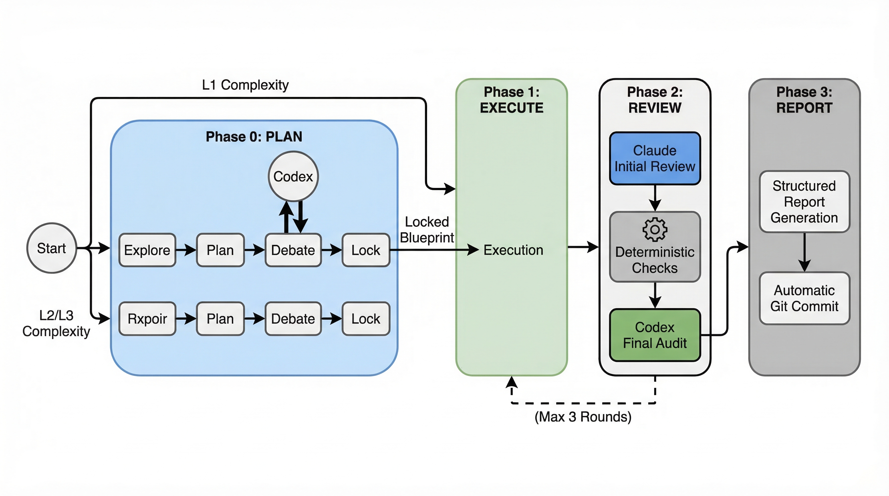
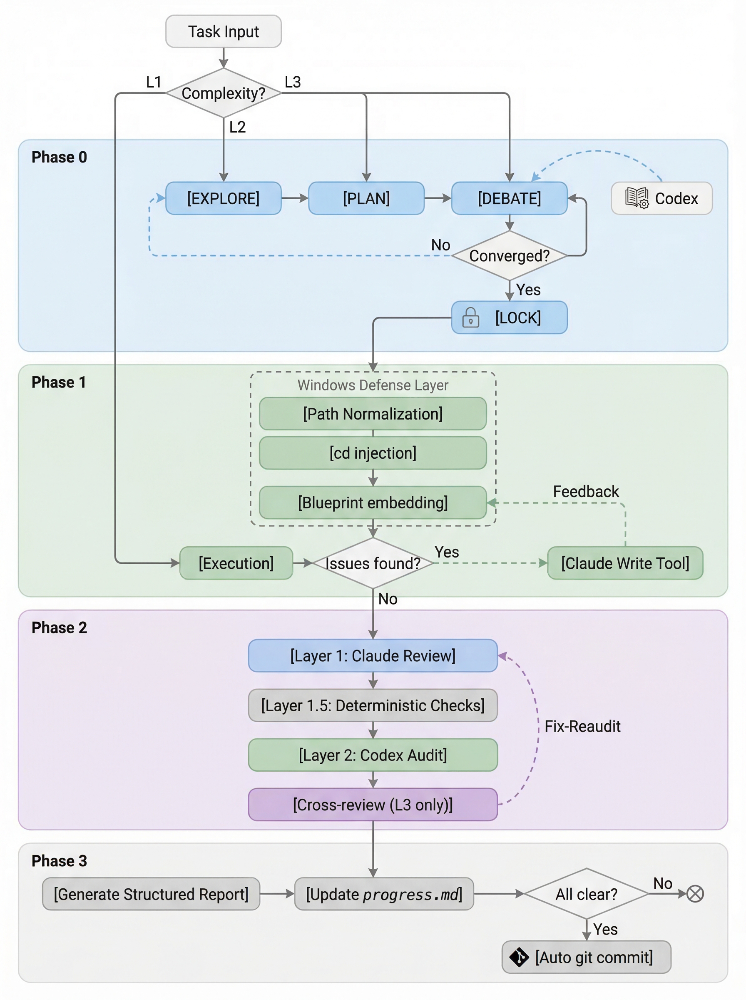

<p align="center">
  
</p>

<h1 align="center">crossfire</h1>
<p align="center">
  <strong>Claude + Codex 双AI协作技能</strong><br/>
  一个负责搭台子，一个负责抡键盘，最后俩人互相挑刺，代码反而更稳了。
</p>
<p align="center">
  
  
  
  
  
</p>

<p align="center">
  <a href="README.md">English</a> | <strong>中文</strong>
</p>

## 为什么用 Crossfire？

把 Claude 和 Codex 关进同一条流水线会怎样？答案是：出乎意料地好用。

`crossfire` 是一个 Claude Code 技能，运行端到端的 **Actor-Critic 流水线**，配对两个来自不同训练分布的 AI 模型。Claude Code（Opus 4.6）扮演架构师和审查员——拿着白板的战略家。Codex CLI（GPT-5.4）扮演执行者和审计员——写码飞快，检查起来像机场安检员一样严格。

核心洞见：异源模型互相挑刺，比同质团队更能发现盲区（[arXiv:2602.03794](https://arxiv.org/abs/2602.03794)）。Phase 0 是 AI 版的"先吵明白"，Phase 2 是"信任但要验证"。最终受益的是你的代码库。

## 工作原理

<p align="center">
  
</p>

流水线分四个阶段——规划、执行、审查、报告：

1. **Phase 0 — 规划**（Claude）：探索代码库 → 起草蓝图 → 与 Codex 对抗辩论 → 锁定最终方案
2. **Phase 1 — 执行**（Codex）：严格按锁定蓝图实现，Windows 环境经过防护层预处理
3. **Phase 2 — 审查**（双方）：Claude 初审 → 确定性检查（测试/linter） → Codex 终审 → 交叉复审
4. **Phase 3 — 报告**：结构化报告 + 自动 git commit

### 工作流分级

| 级别 | 流程 | 适用场景 | 审查强度 |
|:----:|------|---------|:-------:|
| **L1** | 跳过 Phase 0 → 直接执行 → 快速审查 | 小改动、明确修复、低不确定性任务 | 基础 |
| **L2** | 完整四阶段流水线 | 日常默认开发任务 | 较强（3 轮上限） |
| **L3** | 完整流水线 + 强制交叉复审 | 架构升级、高风险重构、关键发布 | 最高 |

文件数和行数指向不同级别时，取更高级别。

## 快速开始

### 前置条件

- [Claude Code](https://docs.anthropic.com/en/docs/claude-code) v1.0+
- [Codex CLI](https://github.com/openai/codex) v0.115.0+ — `npm install -g @openai/codex`
- 在 `~/.codex/config.toml` 中配置模型：
  ```toml
  model = "gpt-5.4"
  model_reasoning_effort = "xhigh"
  ```

### 安装

```bash
git clone https://github.com/PlutoLei/crossfire.git
mkdir -p ~/.claude/skills/crossfire/references
cp crossfire/SKILL.md ~/.claude/skills/crossfire/
cp crossfire/references/*.md ~/.claude/skills/crossfire/references/
```

### 第一个命令

```bash
/crossfire code: 在 src/utils.py 中添加 parse_date 函数，支持 ISO 8601 和中文日期格式
```

## 模板

内置九种模板，覆盖常见开发任务：

| 模板 | 级别 | 用途 | 示例 |
|------|:---:|------|------|
| `code` | L1/L2 | 新功能实现 | `/crossfire code: 添加 parse_date 到 utils.py` |
| `bugfix` | L2 | 根因修复 + 回归防护 | `/crossfire bugfix: 修复混淆矩阵颜色映射` |
| `refactor` | L2 | 改结构不改行为 | `/crossfire refactor: 抽取去重逻辑为独立模块` |
| `test` | L1 | 增补或强化测试 | `/crossfire test: 为 process_one_paper 添加单元测试` |
| `review` | L1 | Codex 独立代码评审 | `/crossfire review: 审查 generate_essay_en.py` |
| `audit` | L2 | 双源并行审核（Claude + code-reviewer agent） | `/crossfire audit: 审核 TextMamba3D 代码变更` |
| `optimize` | L2 | 性能或资源优化 | `/crossfire optimize: 异步批量请求` |
| `architect` | L3 | 系统级架构设计 | `/crossfire architect: 设计 figure compositor` |
| `research` | L2 | 按研究架构实现（自动注入研究产出） | `/crossfire research: 按 architecture_proposal.md 实现` |

**语法：** `/crossfire <模板>: <描述>` 或 `/crossfire L2: <描述>`

**可选标志：** `--no-debate`（跳过辩论）· `--no-audit`（跳过终审）· `--inject-plan <dir>`（注入研究产出）

## 配置

### Codex CLI

`~/.codex/config.toml` 关键配置：

```toml
model = "gpt-5.4"
model_reasoning_effort = "xhigh"

[windows]
sandbox = "elevated"
```

### Windows 防护层

Windows 环境下所有 Codex 调用必须经过预处理：

| 防护项 | 规则 | 影响阶段 |
|--------|------|:-------:|
| 路径归一化 | 所有路径转正斜杠 | 全部 |
| `cd` 注入 | 每个 Codex prompt 第一行固定为 `cd <归一化绝对路径>` | 全部 |
| 蓝图内嵌 | ≤200 行直接嵌入 prompt；>200 行指示 Codex 读文件 | Phase 1 |
| 产出完整性兜底 | 检测缺失/截断文件 → Claude 用 Write 工具补完 | Phase 1 |

## 架构详情

完整的流水线分解——包括 Phase 0 子步骤、多层审查、修复-重审循环和技能委托策略——请参阅[架构文档](docs/architecture.md)。

<p align="center">
  
</p>

## 致谢

- 面向 [Claude Code](https://docs.anthropic.com/en/docs/claude-code) × [Codex CLI](https://github.com/openai/codex) 的 Actor-Critic 流水线
- 灵感来源：[异源多智能体辩论](https://arxiv.org/abs/2602.03794)
- 横幅与图表由 [PaperBanana](https://github.com/PlutoLei/paperbanana) + Google Gemini 生成
- MIT 许可证
